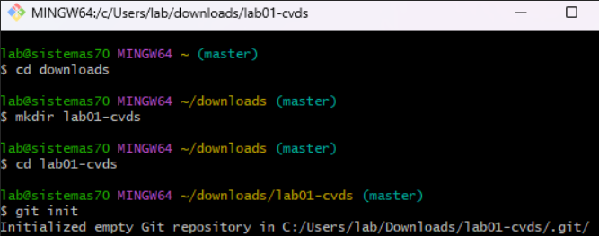
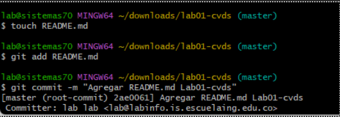
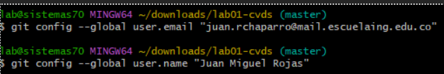
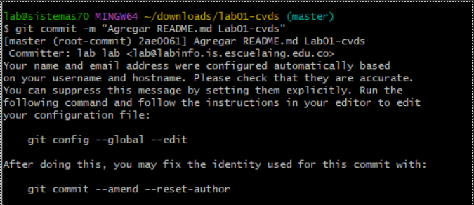
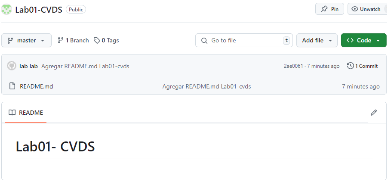
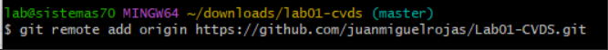
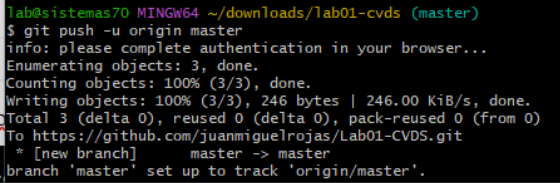
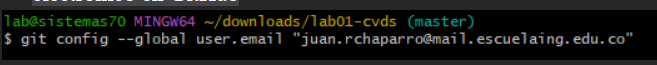

# laboratorio 1
# integrantes 
    Cristian silva
    Juan miguel rojas Chaparro 

# Respuestas
PARTE I
1. Crea un repositorio localmente. 
Procedemos a crear el repositorio de manera local en la terminal de git bash

2. Agrega un archivo de ejemplo al repositorio, el README.md puede ser una gran opción. 
Como se recomienda agregar el archive readme lo agregamos con el comando touch 

3. Averigua para qué sirve y como se usan estos comandos git add y git commit -m “mensaje” 

Git add: 

¿Para qué sirve?: Este comando se utiliza para agregar los cambios de un archivo o archivos a la área de preparación (staging area), que es como un espacio intermedio donde se almacenan los cambios antes de hacer un commit. 

¿Cómo se usa?: Si has modificado un archivo, por ejemplo archivo.txt, y deseas incluirlo en tu próximo commit, ejecutarías: 

git add archivo.txt 

 

Git commit: 

¿Para qué sirve?: Este comando guarda los cambios que han sido agregados previamente al área de preparación (git add) en el historial del repositorio. Al hacer un commit, se crea una instantánea del estado actual del proyecto. 

¿Cómo se usa?: Después de haber usado git add, puedes ejecutar un commit con el siguiente comando: 

git commit -m "Mensaje descriptivo de los cambios" 

4. Abre una cuenta de github, si ya la tienes, enlazala con el correo institucional. 

5. Crea un repositorio en blanco (vacío) e GitHub. 

Este repositorio estaba vacio pero al enlazarse se le agrego el readme y el primer commit 

6. Configura el repositorio local con el repositorio remoto.

7. Sube los cambios, teniendo en cuenta lo que averiguaste en el punto 3 Utiliza los siguientes comando en el directorio donde tienes tu proyecto, en este orden:

8. Configura el correo en git local de manera correcta Configurar correo electrónico en GitHub
En esta parte al introducir el comando github nos arroja una ventana donde se puede ver la sincronizacion del correo con el repositorio local

Ya se inicio session con el mismo correo y todo esta en orden  

9. Vuelve a subir los cambios y observa que todo esté bien en el repositorio remoto (en GitHub).
En este punto ya se puede encontrar el README y la sincronizacion es correcta

PARTE II (Trabajo en parejas) 

1. Se escogen los roles para trabajar en equipo, una persona debe escoger ser "Owner" o Propietario del repositorio y la otra "Collaborator" o Colaborador en el repositorio. 
a. Cristian silva será el owner y juan Miguel rojas será el collaborator.

3. El owner agrega al colaborador con permisos de escritura en el repositorio que creó en la parte 1 

5. El owner le comparte la url via Teams al colaborador 

7. El colaborador acepta la invitación al repositorio

9. Owner y Colaborador editan el archivo README.md al mismo tiempo e intentan subir los cambios al mismo tiempo. 

11. ¿Que sucedió? 
a. Como se intenta hacer un cambio en simultáneo desde la misma rama el git no puede combinar automáticamente ambos cambios y pedirá que se resuelva el conflicto manualmente lo cual se conoce como(merge conflict).

12. La persona que perdió la competencia de subir los cambios, tiene que resolver los conflictos, cúando haces pull de los cambios, los archivos tienen los símbolos <<< === y >>> (son normales en la resolución de conflictos), estos conflictos debes resolverlos manualmente. Como resolver Conflictos GitHub 

14. Volver a repetir un cambio sobre el README.md ambas personas al tiempo para volver a tener conflictos. 
	El conflicto en este caso le apareció a la otra persona en este caso Miguel.

15. Resuelvan el conflicto con IntelliJ si es posible, Resolver conflictos en IntelliJ 
De esta forma ya sabes resolver conflictos directamente sobre los archivos y usando un IDE como IntelliJ, esto te será muy útil en los futuros trabajos en equipo con Git. 
Aquí se puede evidenciar el conflicto encontrado al tratar de hacer los commits al mismo tiempo para solucionarlo se utilizó la herramienta de intellij nos ayuda a identificar los conflictos de manera visual
Aquí solucionamos el conflicto en este caso dejando o uniendo los commits realizado por cada uno.

PARTE III (Trabajo de a parejas)

1. ¿Hay una mejor forma de trabajar con git para no tener conflictos?
Para no llegar a tener conflictos en git podemos realizar la creación de una nueva rama, esta nos va permitir trabajar en una funcionalidad, corrección de errores, o mejoras específicas. Esto separa los cambios del código principal evitando estos errores por trabajar la misma rama al tiempo.

2. ¿Qué es y como funciona el Pull Request?
Primero que todo se realiza la creacion de la rama sobre la cual se va a trabajar 
Se hacen los cambios necesarios en el código dentro de la rama creada, y luego se confirman (commit) en el repositorio local.
La rama con los cambios se sube (push) al repositorio remoto (por ejemplo, GitHub).
Otros desarrolladores revisan el código del pull request. Esto incluye verificar que los cambios no introduzcan errores, se adhieran a los estándares de codificación, y sean adecuados para el proyecto.
Se pueden agregar comentarios, solicitar cambios adicionales o aprobar el PR.
Si los cambios son aprobados, el PR se fusiona (merge) con la rama de destino.
Si hay problemas importantes, el PR puede ser rechazado o el autor deberá hacer ajustes y actualizaciones.

3. Creen una rama cada uno y suban sus cambios

4. Tanto owner como colaborador hacen un cambio en el README.md y hacen un Pull Request (PR) a la rama main/master
 (Recomendación : deben trabajar en equipo y distribuirse de mejor manera quien va a modificar qué, para evitar modificar los mismos archivos al mismo tiempo, si no se editan los mismos archivos la resolución de conflictos es automática)
Aquí tenemos el pull request realizado por el colaborador en este caso es el pull request de Miguel, como se puede ver en la siguiente imagen esta el nombre de este con los cambios realizados en el README

5. Teniendo en cuenta la recomendación, mezclen los cambios a la rama main a través de PR con el check/review/approval del otro compañero (Cuando se hace merge se deberían borrar las ramas en github)

aqui hacemos la regla para eliminar automaticamente las ramas despues del Pr

como modificamos el mismo archivo tocó hacer la resolución de conflictos

manualmente aquí aprobamos los PR de cada uno a continuación las evidencias 

aqui hacemos el merge con ambos PR y se eliminan automáticamente las ramas 

